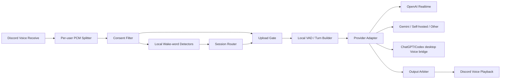
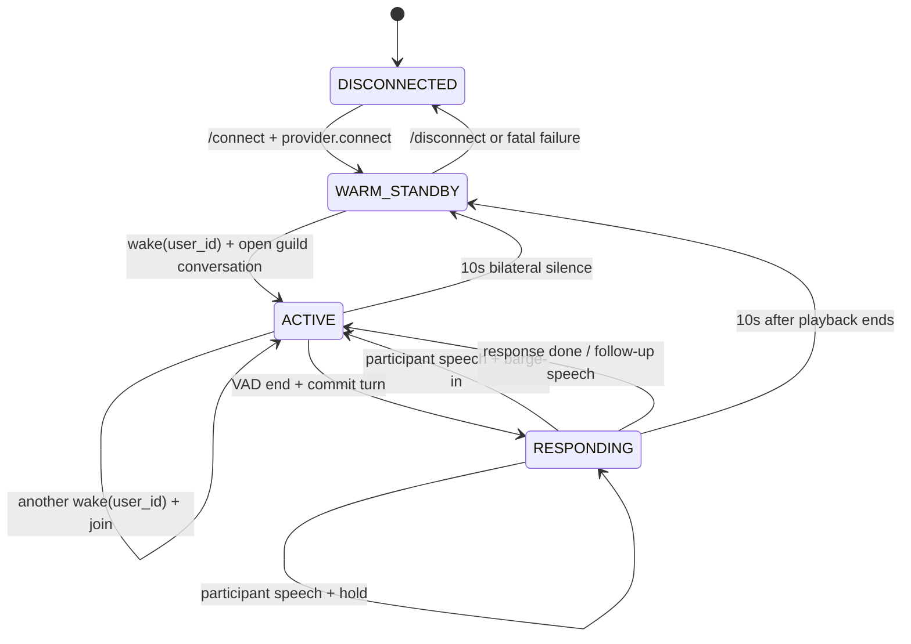

# Discord 唤醒词语音助手设计

状态：Draft v0.6（V1 + desktop Voice bridge implemented，2026-09-02）
基础项目：[Monoese/VoiceCordAI](https://github.com/Monoese/VoiceCordAI)（MIT）

## 1. 目标

在 Discord 语音频道中，本地按 `user_id` 分离音频并检测唤醒词。Bot 加入频道时预先建立 AI Realtime 连接，但在唤醒成功之前：

- 不向 AI 后端发送任何 Discord 音频；
- 不提交 input buffer；
- 不触发模型生成；
- 只允许已经明确同意录音的用户进入唤醒检测。

第一名用户唤醒后，guild 进入一段共享语音会话。所有已同意用户的本地唤醒检测仍持续运行；另一名用户说出关键词时，他会加入同一个 AI session，并按配置立即打断 Agent 或等待当前回复结束。已经加入的用户后续不必重复唤醒词，其正常说话也可触发 barge-in。全频道与 Agent 静默 10 秒后结束本轮共享会话，重新回到本地唤醒状态。AI 后端必须可配置；V1 以 Gemini Live 和 Grok Speech-to-Speech 为双第一公民。

## 2. 核心结论

### 同一个 session

V1 固定为每个 `guild_id` 一个 Realtime session，整个频道共享上下文。Session Router 保存 `active_participants: set[user_id]`，而不是单一 authority user。

第一名用户说出关键词时打开会话；其他已同意用户即使在会话进行中，仍可通过关键词加入。加入后的用户与原用户拥有相同发言权。Agent 正在输出时，`barge_in` 策略会停止播放并取消/截断模型回复；`hold` 策略会先在本地保存完整 utterance，等当前回复结束后再送入同一个 session。这样在产品体验上等价于把新用户加入同一条语音信道。

Realtime session 仍只有一个输入音频缓冲区和一条 conversation 时间线，因此本地需要一个 Guild Audio Multiplexer：

- 按 Discord 时间戳把已加入用户的 PCM 排入同一流；
- 发言人切换时插入轻量文本标记，例如 `[speaker: Alice]`；
- 两人同时说话时混音并限幅，但模型不能获得可靠的原生 speaker diarization；
- V1 接受“建议轮流说话”的限制，不承诺重叠语音的发言人识别准确率。

### 不同 session（V1 不实现）

可以按 `(guild_id, user_id)` 建立独立 session，并发做语音识别、推理和生成。上下文和取消操作彼此隔离，最适合私密对话。

但 Discord 频道里仍只有一个 Bot 输出端。多个模型可以并发处理，最终播放必须由 Output Arbiter 排队；直接把多个回复混在同一频道会很难听清。

### 推荐默认值

第一版只实现 `guild_serial`：每个 guild 一条预热连接、一个共享 conversation、一条 Agent 输出。不同用户可依次或通过 barge-in 加入，不创建 per-user session。除 Gemini/Grok API 外，个人部署可选择 `desktop_voice`，把已登录的 ChatGPT/Codex Voice 桌面会话作为同一条共享 conversation。

## 3. 总体架构



关键边界：`Upload Gate` 默认关闭。首个关键词命中后，只为该用户打开；其他用户必须各自命中关键词后才会被加入 `active_participants`。未加入用户的音频即使仍在本地被接收，也不能进入 provider adapter。

## 4. 状态模型



`10s bilateral silence` 的定义：所有 `active_participants` 都没有有效语音、没有待提交 turn、模型没有生成、Bot 没有播放。模型正在说话时不能误触发超时；播放结束后才开始完整的 10 秒窗口。

建议把“结束对话”和“关闭传输”拆开：

- `release_participants`（默认）：10 秒后清空参与者集合、关闭上传门，但保留预热连接；
- `close_session`：10 秒后关闭当前 provider session，并立刻或按需建立一个没有上下文的新预热 session；
- `disconnect_provider`：彻底断开，下一次唤醒再连接，延迟最高但资源占用最低。

OpenAI 的 WebSocket 连接本身就是一个 Realtime session，因此 `release_user` 会保留已有上下文。若不允许下一位用户看到上一位用户的上下文，应选择 `user_parallel` 或 `close_session`。

## 5. V1 session 路由与发言策略

| 模式 | Session key | 处理并发 | 上下文 | 输出策略 | 适用场景 |
|---|---|---:|---|---|---|
| `guild_serial` | `guild_id` | 1 | 全频道共享 | 直接播放 | 会议室助手、共同问答 |

所有 consented user 的 wake-word detector 在 `WARM_STANDBY`、`ACTIVE`、`RESPONDING` 三个状态下都保持工作。输入权限按用户状态判断：

| 输入来源 | 是否需要关键词 | Agent 正在说话时 |
|---|---|---|
| 已在 `active_participants` 的任意用户，包括最初唤醒者 | 不需要 | 按 `ACTIVE_PARTICIPANT_SPEECH_POLICY` 执行 |
| 未加入但已 consent 的用户 | 需要，命中后立即加入 | 按 `NEW_PARTICIPANT_WAKE_POLICY` 执行 |
| 未 consent，或未加入且未命中关键词 | 不允许上传 | 忽略 |

两项策略都支持：

- `barge_in`：立即打断 Agent；
- `hold`：不中断 Agent，在本地按时间戳保存该用户完整 utterance，当前回复结束后按队列顺序提交；
- `ignore`：丢弃本次输入，仅用于特殊主持/广播场景，不作为默认值。

V1 默认两者均为 `barge_in`。因此同一个用户当然可以打断：一旦用户 A 已加入共享会话，A 在 Agent 说话时再次开口即可 barge-in，不需要再说一次关键词。新用户 B 仍需先用关键词取得上传权限。

执行 `barge_in` 时：

1. 将该用户加入 `active_participants`；
2. 立即停止 Discord 本地播放，并记录已实际播放的 `audio_end_ms`；
3. 取消当前 response；
4. 对 WebSocket provider 发送等价于 `conversation.item.truncate` 的事件，删除模型 conversation 中用户没听到的后半段；
5. 插入 speaker marker，并将该用户的 pre-roll 与后续 PCM 送入当前 session；
6. 由同一模型基于共享上下文处理这次打断。

执行 `hold` 时不把音频提前发送给 provider，以免服务端 VAD 自动取消 response。每个 held utterance 必须设置时长和内存上限；队列按 `speech_started_at` 排序，相同时间用 Discord sequence 打破并列。若多个用户真正重叠，仍会作为独立排队 turn，而不是混成一个 turn。

OpenAI 在启用 VAD 时可以检测输入语音并取消正在生成的 response；但 Discord Bot 使用 WebSocket 且自行播放音频，因此本地仍必须负责“立刻停播 + 按真实播放位置 truncate”。官方说明见 [Interruption and Truncation](https://developers.openai.com/api/docs/guides/realtime-conversations#interruption-and-truncation)。

## 6. 预连接与零上传保证

`/connect` 顺序：

1. 加入 Discord voice channel；
2. 初始化每个已同意用户的本地 wake-word detector；
3. 建立默认 provider 的预热连接；
4. 发送必要的 session 配置，例如音频格式、voice、instructions 和关闭服务端自动 VAD；
5. 进入 `WARM_STANDBY`。

第 4 步是连接配置，不是模型生成请求。唤醒前严禁调用：

- `append_audio` / `input_audio_buffer.append`；
- `commit_turn` / `input_audio_buffer.commit`；
- `request_response` / `response.create`。

代码层采用三重保护：

1. 本地 consent filter；
2. `UploadGate.active_participants` 校验；
3. ProviderAdapter 在非 `ACTIVE` 状态拒绝 `append_audio`。

同时记录 `upstream_audio_bytes_before_wake` 指标，验收值必须始终为 0，但日志中不记录原始音频。

## 7. 一次交互的时序

```mermaid
sequenceDiagram
    participant U as Discord user A
    participant U2 as Discord user B
    participant B as Bot/local audio
    participant R as Session Router
    participant P as Provider session

    B->>P: connect + configure (no Discord audio)
    U->>B: wake word + question
    B->>B: local wake detection
    B->>R: open(guild, user A)
    R-->>B: participant A added; upload gate opens for A
    B->>P: append A's post-wake PCM
    B->>P: commit turn + request response
    P-->>B: streamed response audio
    B-->>U: serialized Discord playback
    U2->>B: wake word + interruption
    B->>B: stop playback; measure played_ms
    B->>P: cancel + truncate unplayed audio
    B->>R: add participant B
    B->>P: speaker marker + B audio in same session
    P-->>B: new response using shared context
    Note over B,P: no user speech and no playback for 10s
    B->>R: release lease; close upload gate
```

为避免唤醒检测的计算延迟切掉问题开头，本地保留约 250–500 ms 的 per-user ring buffer。只有检测阳性的那个用户、且只有阳性后的会话，才允许把这段 pre-roll 合并进首个 turn。

## 8. 可替换后端接口

业务层不直接依赖 OpenAI SDK，而依赖统一协议：

```python
class RealtimeProvider:
    capabilities: ProviderCapabilities

    async def connect(self, config) -> ProviderSession: ...
    async def configure(self, session, config) -> None: ...
    async def append_audio(self, session, pcm: bytes) -> None: ...
    async def commit_turn(self, session) -> None: ...
    async def request_response(self, session) -> None: ...
    async def cancel_response(self, session) -> None: ...
    async def truncate_response(self, session, item_id, audio_end_ms) -> None: ...
    async def add_context_item(self, session, item) -> None: ...
    async def close(self, session) -> None: ...
```

`ProviderCapabilities` 至少包含：输入采样率、声道数、是否支持流式音频、是否支持手动 commit、是否支持 cancel、最大 session 时长、是否能保留上下文。Session Router 只按能力调用，不判断 provider 名称。

V1 adapter：

- `GeminiLiveProvider`：默认 provider，复用并重构原项目已有实现，启用原生 Google Search；
- `GrokRealtimeProvider`：使用 xAI Realtime WebSocket，启用原生 `web_search` 和可选 `x_search`；
- `DesktopVoiceProvider`：Discord PCM 经 Voicemeeter B1 送入已登录的
  ChatGPT/Codex Voice，模型输出经独立 B2 总线回到 Discord；不使用
  OpenAI API key，也不把 ChatGPT 订阅伪装成 API。同机运行个人 Discord
  客户端时必须使用应用级设备路由：Discord 固定实体麦克风/扬声器，只有
  ChatGPT/Codex 使用 B1/AUX；不得把 B1/B2 设为全局录音默认值；
- `FakeRealtimeProvider`：用于 session、上传门、hold/barge-in 和故障测试。

OpenAI、Deepgram、Amazon Nova 和自建 WebSocket adapter 保留在扩展路线，不阻塞 V1。

### Provider 选择

| Provider | 语音形态 | 联网/工具 | 多模态 | 对本项目的意义 |
|---|---|---|---|---|
| Google Gemini Live | 原生双向语音 WebSocket | Live session 可直接启用 Google Search 和 function calling | 音频、图片、视频输入 | V1 默认；当前基础项目已有 Gemini 代码 |
| xAI Grok Speech-to-Speech | 原生双向语音 WebSocket | 原生 `web_search`、`x_search` 和 function | 当前 voice API 重点是文本/音频；搜索结果可理解图片 | V1 同级 provider；讨论热点可直接查 X |
| Amazon Nova 2 Sonic | Bedrock 双向 speech-to-speech | tool use；Nova 系列可结合 web grounding | Nova 家族支持多模态，Sonic 应按其独立 model card 校验具体输入 | 适合已在 AWS、需要 Bedrock 治理的部署 |
| Deepgram Voice Agent | 流式 STT + 可选 LLM + TTS 编排 | function calling；LLM 可选 OpenAI、Anthropic、Google、Groq、NVIDIA、Bedrock 或自建 | 主要是语音管线，不是视觉模型 | Provider 自由度最高，也支持 fallback；但按 WebSocket 连接时间计费 |
| 自建 Pipeline | 本地/云 STT → LLM → TTS | 完全自定义搜索和数据源 | 由所选 LLM 决定 | 控制力最高，但中断、时序、延迟和运维都要自己负责 |
| ChatGPT/Codex desktop Voice | Windows 双向虚拟音频；个人订阅 UI | 使用桌面 Voice 自身的搜索能力 | 桥接层当前只传音频；未来图片仍需桌面 UI/自动化 | 无独立 API 费用，适合单人专用电脑；非官方 backend endpoint，需保持桌面 Voice 会话 |

Gemini Live 官方当前模型为 `gemini-3.1-flash-live-preview`，支持 Live Google Search；audio-only session 原生上限 15 分钟，需要 session resumption。价格等价于用户音频 $0.005/分钟、模型音频 $0.018/分钟。参考：[Gemini Live tools](https://ai.google.dev/gemini-api/docs/live-api/tools)、[Gemini pricing](https://ai.google.dev/gemini-api/docs/pricing)、[Live limitations](https://ai.google.dev/gemini-api/docs/live-api/capabilities#limitations)。

xAI 当前 `grok-voice-latest` 指向 `grok-voice-think-fast-2.0`，官方称其兼容 OpenAI Realtime API，并能在同一 voice session 中配置 Web、X 和自定义函数搜索。2.0 的价格是发送或接收音频 $0.08/分钟，Web/X Search 各 $5/1,000 calls。V1 固定版本名而不使用 `latest`，避免别名切换导致价格漂移。参考：[Grok Speech-to-Speech](https://docs.x.ai/developers/model-capabilities/audio/speech-to-speech)、[xAI pricing](https://docs.x.ai/developers/pricing)。

## 9. 截至 2026-09-02 的 OpenAI Realtime 参考（V1 之后）

| 模型 | 定位 | 文本 $/1M（入/出） | 音频 $/1M（入/出） | 图片输入 | Function calling | V1 建议 |
|---|---|---:|---:|---|---|---|
| `gpt-realtime-2.1` | 最新完整型号；更好的噪声、静默、字母数字识别和打断 | $4 / $24 | $32 / $64 | 是 | 是 | 高质量档 |
| `gpt-realtime-2.1-mini` | 更快、低成本的蒸馏型号 | $0.60 / $2.40 | $10 / $20 | 是 | 是 | 默认开发/规模化档 |
| `gpt-realtime-2` | 2.1 的前代，价格相同 | $4 / $24 | $32 / $64 | 是 | 是 | 无特殊理由不新选 |
| `gpt-realtime-1.5` | 较短上下文的传统 voice-agent 型号 | $4 / $16 | $32 / $64 | 是 | 是 | 可做语音风格 A/B |
| `gpt-realtime-translate` | 流式语音翻译，$0.034/分钟 | 不按此方式计费 | 时长计费 | 否 | 否 | 不适合问答助手 |

`gpt-realtime-mini` 与较老的 `gpt-realtime` 系列已经进入 deprecated 范围，不作为新项目默认值。官方当前目录见 [Realtime models](https://developers.openai.com/api/docs/models)，价格见 [GPT-Realtime-2.1](https://developers.openai.com/api/docs/models/gpt-realtime-2.1)、[GPT-Realtime-2.1 Mini](https://developers.openai.com/api/docs/models/gpt-realtime-2.1-mini) 和 [API pricing](https://developers.openai.com/api/docs/pricing)。

若 V1 之后补 OpenAI adapter，可用 `gpt-realtime-2.1-mini` 做日常游戏问答，并以 `gpt-realtime-2.1` 作为复杂攻略、多人打断和工具调用质量基准；它们不进入当前实现关键路径。

## 10. 联网搜索设计

V1 不实现 MCP，也不实现“Realtime 模型 → 独立文本模型 → Web search”的桥接。联网搜索直接使用两个第一公民 provider 的 session-native tool：

```text
GeminiLiveProvider -> google_search
GrokRealtimeProvider -> web_search
                     -> x_search（仅社区/X 讨论，默认关闭）
```

两个 adapter 都通过统一的 `NativeSearchPolicy` 配置是否允许搜索、允许的域名以及讨论来源。业务层只表达 `search_mode=auto|off`，不模拟或代理 provider 的搜索协议。ARAM Mayhem 的结构化统计仍走 `GameKnowledgeRouter`，这样 provenance、patch 和样本量不会因模型切换而丢失。

游戏问答推荐两级工具：优先查询已缓存的官方 patch notes、游戏 API 或可信 Wiki；只有数据缺失或问题明确涉及最新变化时才调用开放 Web search。这样比每个问题都搜索更快、更稳定。

### OP.GG、ARAM Mayhem 与 Reddit

OP.GG 官方明确表示其游戏数据不会提供给第三方；网页抓取通常不被一概禁止，但必须注明来源、不得造成过量请求，商业使用尤其需要谨慎。因此不把非公开 OP.GG endpoint 当作稳定 API。`OPGGScraperProvider` 只作为默认关闭的 experimental adapter，必须缓存、限速、保留来源 URL，并允许随时熔断。参考：[OP.GG data policy](https://help.op.gg/hc/en-us/articles/31091405109401-Can-I-use-OP-GG-data)。

ARAM Mayhem 的关键限制是 Riot 公共 API 不提供 queue `2400` 的完整对局。当前最贴近本项目的开源半成品有：

- [ARAM-Mayhem-Database](https://github.com/Lanternko/ARAM-Mayhem-Database)（MIT）：通过玩家本机 LCU 收集 Mayhem 对局、去标识化聚合，并提供 tier list / augment / FastAPI 管线；这是最值得复用的数据层；
- [ARAM Oracle](https://github.com/fabs133/league-aram-builder)（MIT）：通过 Live Client Data、LCU 和 OCR 实时给出增幅、装备、reroll 建议；它的本地 companion + WebSocket 架构与未来的游戏截图/实时状态扩展最接近；
- [mayhem-overlay](https://github.com/zp96-cmd/mayhem-overlay)：展示 LCU、Live Client Data、CommunityDragon 和本地 OCR 的组合方案，可作实现参考，但不应依赖它未文档化的第三方数据 endpoint。

公开统计站还包括 [arammeta](https://arammeta.com/)、[ARAMGG](https://aramgg.com/) 和其他社区 tier list。它们可以进入 `CommunityMetaProvider`，但每条结果必须带 `patch`、地区、样本量、更新时间和来源；不能把不同站点或不同 patch 的胜率直接混合。ARAM-Mayhem-Database 自身也说明其 LCU 聚合存在地区和样本偏差。

V1 的 `GameKnowledgeRouter` 顺序建议为：

```text
1. StaticGameDataProvider: Riot patch notes + Data Dragon + CommunityDragon
2. LocalGameProvider: 桌面 companion 的 Live Client Data / LCU
3. CommunityMetaProvider: arammeta / 经允许的 ARAMGG 等聚合结果
4. NativeDiscussionSearch: provider 原生搜索，尽量限定 reddit.com；Grok 可额外启用 X
5. NativeGeneralWebSearch: provider 原生开放网络兜底
```

Reddit 有两种接法：

- V1 推荐使用当前模型的 Web Search，并把域名限制为 `reddit.com`，只在用户明确问“大家怎么讨论”时调用；返回帖子时间、subreddit、赞同不代表事实的提示和原帖链接；
- 如果以后需要稳定读取指定 subreddit 的帖子/评论和排序，再申请 Reddit Data API / Devvit 权限。官方 API 支持读取帖子和评论，但 Data API 存在授权、认证、限速、数据保存及商业用途限制，不建议自行大规模抓站。参考：[Reddit API overview](https://developers.reddit.com/docs/capabilities/server/reddit-api)。

讨论内容只作为“玩家观点”证据，不能覆盖 patch notes 或结构化胜率数据。Search result 在送给模型前统一转成 `KnowledgeResult {source_type, title, url, published_at, patch, region, sample_size, excerpt, confidence}`。

## 11. 粗略成本

统一估算场景：一小时游戏中问 20 次，每次用户说 5 秒、Agent 回答 8 秒，其中 10 次联网搜索。即用户有效语音 100 秒、模型有效语音 160 秒；空闲待机不主动发送 Discord 音频。

### Gemini 3.1 Flash Live

官方等效价格为用户音频 $0.005/分钟、模型音频 $0.018/分钟：

- 用户音频：1.667 分钟 × $0.005 = **$0.0083**；
- 模型音频：2.667 分钟 × $0.018 = **$0.0480**；
- 新增音频合计约 **$0.056/小时**。

Gemini 3.x paid tier 当前每月前 5,000 次 Google Search 免费，超出后 $14/1,000 queries，即 $0.014/次。本例 10 次搜索在免费额度内为 $0；超额阶段为 $0.14。考虑文本、思考、转录和长 conversation 重计费，工程预算为：

- 尚有免费 Search 额度：约 **$0.08–$0.15/小时**；
- 已超过 5,000 次/月：约 **$0.22–$0.30/小时**。

Gemini 会随持久 session 累积上下文，后续回合可能重计历史音频。为控制费用，15 分钟 session resumption 时应生成短 summary，而不是重放全部原始音频。

### Grok Voice Think Fast 2.0

`grok-voice-think-fast-2.0` 按发送或接收的音频总时长 $0.08/分钟计费：

- 总音频：1.667 + 2.667 = 4.334 分钟；
- 语音费用约 **$0.347/小时**；
- 10 次 Web Search：10 × $0.005 = **$0.05**；
- 如果每个问题都发送一个独立 speaker text marker，20 × $0.004 = **$0.08**。

因此本例约 **$0.48–$0.60/小时**。实现时只在 speaker 真正切换时发送 marker，避免无意义的 $0.004 text-input 事件。`grok-voice-think-fast-1.0` 虽为 $0.05/分钟，但已 deprecated；不能拿它的 $3/小时宣传价估算 `grok-voice-latest`，因为 latest 已路由到 2.0（$4.80/连续音频小时）。

以上均是有效输入/输出语音场景预算，不是 Bot 在频道停留一整小时的固定费用。实际账单受打断、输出长度、搜索次数、speaker marker、转录和上下文策略影响。参考：[Gemini pricing](https://ai.google.dev/gemini-api/docs/pricing)、[xAI pricing](https://docs.x.ai/developers/pricing)。

## 12. 图片 + 语音多模态扩展

Gemini 3.1 Flash Live 支持音频、图片和视频输入，V1 的 provider interface 会预留 `append_image()`，但不实现自动截图。Grok 当前 Speech-to-Speech API 的直接会话重点是文本/音频；它可以理解 Web/X Search 找到的图片，但本地截图输入不作为 V1 Grok 能力承诺。

Discord Bot 本身看不到玩家游戏画面，因此图片来源需要另行提供，例如 Discord 图片附件、截图命令、OBS/桌面 companion 或游戏插件。建议只在显式触发时抓取单帧，不持续上传画面。Gemini 当前图片/视频输入等效约 $0.002/分钟媒体输入，仍应配置帧率和总量上限。

## 13. 配置草案

```env
AI_PROVIDER=gemini
GEMINI_MODEL=gemini-3.1-flash-live-preview
GROK_MODEL=grok-voice-think-fast-2.0

SESSION_ROUTING_MODE=guild_serial
PRECONNECT_MODE=guild
ACTIVE_PARTICIPANT_SPEECH_POLICY=barge_in
NEW_PARTICIPANT_WAKE_POLICY=barge_in
HELD_TURN_MAX_SECONDS=30
HELD_TURN_QUEUE_MAX=4
MAX_ACTIVE_SESSIONS_PER_GUILD=1
MAX_ACTIVE_SESSIONS_GLOBAL=20

CONVERSATION_IDLE_TIMEOUT_SECONDS=10
IDLE_ACTION=release_participants
TURN_END_SILENCE_MS=800
PRE_ROLL_MS=350

NATIVE_WEB_SEARCH_MODE=auto
PREFERRED_SEARCH_SOURCES=op.gg,leagueoflegends.com,wiki.leagueoflegends.com,reddit.com/r/ARAM
VOICE_ACCESS_MODE=implicit
GROK_X_SEARCH_ENABLED=false
GAME_DATA_PROVIDERS=static,local_lcu,arammeta,web
DISCUSSION_PROVIDER=native_search
DISCUSSION_ALLOWED_DOMAINS=reddit.com
OPGG_SCRAPER_ENABLED=false

GEMINI_API_KEY=...
XAI_API_KEY=...
CUSTOM_REALTIME_URL=...
```

`VOICE_ACCESS_MODE=implicit` 是 V1 默认值：Bot 连入频道时，频道内所有非 Bot
成员会自动获得关键词检测权限；之后加入的成员也会自动加入，离开即撤销，不需要点击
👂。如果部署环境需要显式同意，可改为 `explicit` 恢复 reaction consent。

`PREFERRED_SEARCH_SOURCES` 是系统提示中的来源优先顺序，不是 Google Search 的硬域名
白名单。Gemini 仍会自行决定搜索查询和最终来源；如果未来需要强制限定域名，应增加独立
搜索后端或专用 API，而不能只依赖 prompt。

`PRECONNECT_MODE` 可选：

- `guild`：每个 guild 预热一个 session，适配 `guild_serial`；
- `consented_users`：为已同意用户分别预热，资源消耗最高；
- `pool`：预热 N 个匿名 slot，唤醒后绑定；使用过的 slot 在归还前必须重建，避免上下文泄漏；
- `none`：唤醒后才连接。

## 14. 资源限制与故障处理

- Session Router 使用 guild 级锁，使几乎同时发生的唤醒按确定顺序加入同一 participant set。
- 全局 semaphore 限制 provider 连接数，避免触发账户 rate limit。
- 每个 user buffer、等待队列、输出队列均设置上限；超限丢弃最旧的未提交音频并报警。
- provider 预连接失败不影响 Discord 本地待机；后台指数退避重连，上传门保持关闭。
- active 期间 provider 断线时，丢弃尚未提交的音频、释放 lease，并提示用户重新说唤醒词。
- 切换 provider 只作用于新 session；已有 active turn 完成或被显式取消后再迁移。

## 15. 验收标准

1. Bot 待机 60 秒并有多人聊天时，provider 收到的 Discord 音频字节数为 0。
2. 用户 A 唤醒后，未唤醒的用户 B 音频不会上传；B 命中关键词后才加入同一 session。
3. `barge_in` 下，B 在 Agent 播放时唤醒会立即停播，旧 response 被 cancel/truncate，B 的问题进入同一 conversation。
4. `hold` 下，B 的完整 utterance 只保存在有上限的本地队列；当前回答结束前 provider 不收到 B 的音频，之后按时间戳提交。
5. A 已加入后无需重复关键词；A 在 Agent 播放时开口，也按 active-participant 策略正确 barge-in 或 hold。
6. 发言人切换时产生 speaker marker；重叠说话不会造成 PCM 溢出或削波。
7. 全 guild 始终只有一个 provider session 和一条 Agent 输出。
8. 任一参与者或模型正在说话时不会触发 10 秒超时；全体停止后约 10 秒清空 participant set。
9. timeout、手动取消、provider 断线都会关闭上传门并清理内存音频。
10. Gemini 和 Grok 都能用各自原生 Web Search 回答当前信息；关闭 search 后不会偷偷调用网络工具。
11. GameKnowledgeRouter 保留 patch、地区、样本量、更新时间和 URL；Reddit 结果不会被表述成官方事实。
12. 用 fake provider 跑同一组 contract tests，证明业务层不依赖 Gemini 或 xAI 专有事件。

## 16. 实施顺序

1. 保留现有 `/connect` 预连接行为，新增严格的 Upload Gate 和零上传测试。
2. 把现有 `AIServiceCoordinator` 拆成 Provider Adapter、Guild Session Router 和 Upload Gate。
3. 将现有 Gemini 实现升级为 `GeminiLiveProvider`，配置原生 Google Search。
4. 实现 `GrokRealtimeProvider`，配置原生 Web Search 与可选 X Search。
5. 完成 `guild_serial`、participant set、speaker marker、连续多轮和 10 秒 bilateral idle。
6. 完成 active/new-participant 两套策略、held-turn queue、Provider cancel 和同用户/跨用户 barge-in。
7. 加入 `GameKnowledgeRouter`，优先复用 ARAM-Mayhem-Database 的 LCU/聚合思路，再接 provider-native Reddit search。
8. 补充指标、负载测试与图片接口；OpenAI、Deepgram、自建 WebSocket 和 MCP 均放到 V1 之后。

V1 已确定：Gemini Live 与 Grok Speech-to-Speech 双第一公民，直接使用各自原生联网搜索且不实现 MCP；全频道共享上下文、每 guild 一个 session；新用户关键词后加入，已加入用户无需重复关键词；同用户和跨用户在 Agent 输出期间都按可配置的 `barge_in` / `hold` 策略处理；10 秒后清空参与者但保留预热连接。

## 17. 当前实现状态（2026-09-02）

已落地：

- Gemini 默认升级到 `gemini-3.1-flash-live-preview`，Live session 直接配置 `google_search`；
- 新增 Grok Speech-to-Speech WebSocket adapter，固定 `grok-voice-think-fast-2.0`，直接配置 `web_search` 和可选 `x_search`；
- `guild_serial` router、per-user upload gate、active participant set 和 speaker-switch marker；
- active/new participant 两套独立 `barge_in | hold | ignore` 策略；
- 已加入用户无需再次说关键词即可开启下一次录音，同用户也可以 barge-in；
- 有上限的 held-turn queue，以及双向静默 10 秒后清空 participant、保留 provider 热连接；
- provider-native search、路由、上传门和 Grok 协议的单元测试。

仍在后续迭代：

- 按 Discord 时间戳混合真正重叠的多用户 PCM；当前 V1 路径在单个 utterance 录制期间仍串行化输入；
- 250–500 ms pre-roll、按真实播放毫秒数 truncate，以及 Gemini session resumption summary；
- `GameKnowledgeRouter` 和 ARAM Mayhem/LCU 数据 adapter；这些不阻塞原生 Web Search 的第一版。
